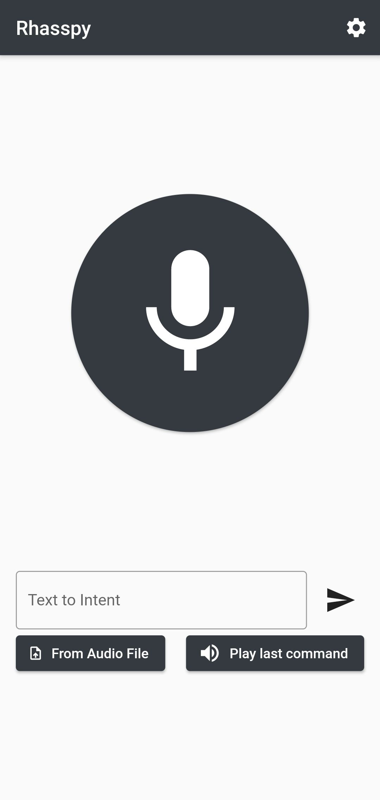

# Rhasspy mobile app

This is a simple mobile app that interfaces with rhasspy. 


# Features
  - Text to speak
  - Speech to text
  - ability to transcribe audio

# Getting Started

For android you can install the app by downloading the file with extension .apk and then open it in your phone after accepting the installation from unknown sources. It is not yet available for ios. 


# Building From Source
To get started you need to install [flutter](https://flutter.dev/docs/get-started/install) and then you can download the repository.  
```bash
git clone https://github.com/razzo04/rhasspy-mobile-app.git
cd rhasspy-mobile-app
```
For build android.
```bash
flutter build apk
```
For build ios you need macOS and Xcode.
```bash
flutter build ios
```


# TODO 

 - Wake word
 - Ssl for rest api 
 - Intent display
 - mqtt and hermes
